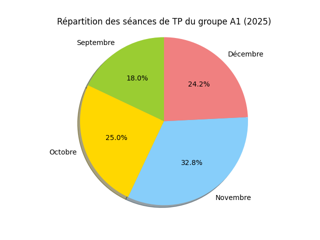

# SAE 1.05 – Analyse des séances de TP

## Travail 3 : Tableau des séances R1.07

Le tableau ci-dessous présente les séances de la matière **R1.07** pour l’année 2025.

| Date       | Heure début | Heure fin | Groupe | Salle |
|------------|-------------|-----------|--------|-------|
| 15/09/2025 | 15:00       | 17:00     | B2     | D028  |
| 22/09/2025 | 15:00       | 17:00     | B2     | D028  |

---

## Travail 4 : Diagramme circulaire

Le diagramme suivant représente la répartition des séances par matière pour le groupe **B2**.

---

*Document généré automatiquement avec Python et Markdown.*
